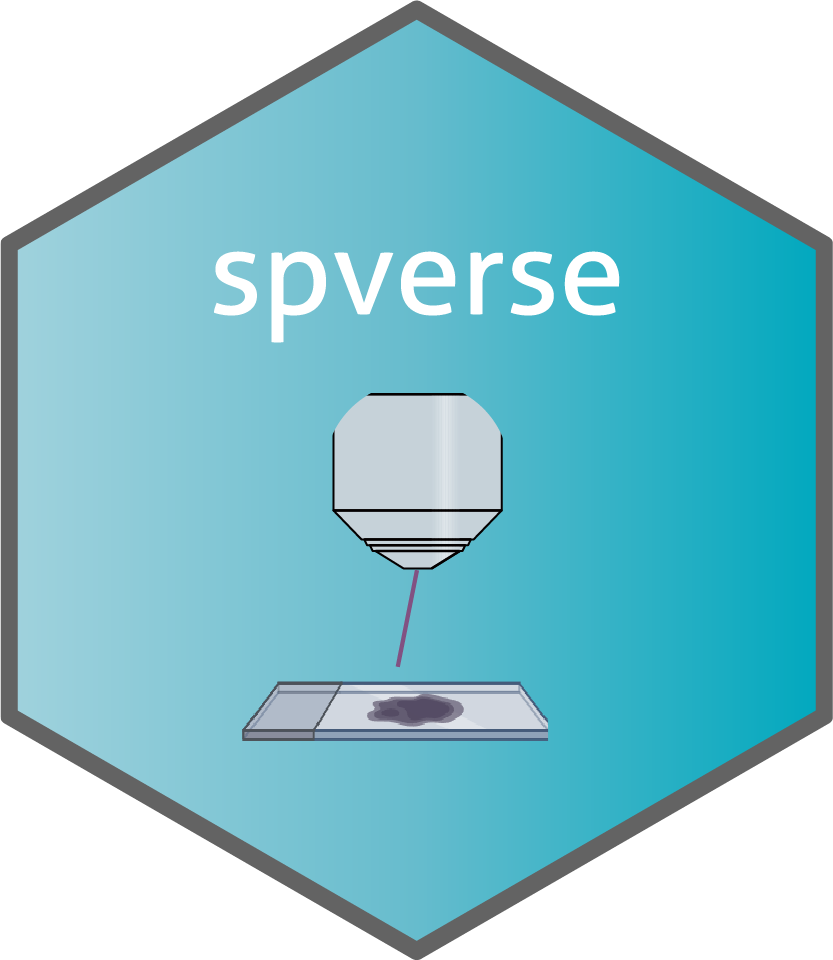

# spverse 

- Spatial omics is a frontier that provides plentiful information regarding gene expression and functions with characteristics of spatial distribution, of which the technology and bioinformatics related to spatial transcriptomics have reached a maturation level, whereas that in spatial proteomics is still at an infant phase. As spatial proteome sampling from tissues and identifying as well as quantifying on peptides are so different from spatial transcriptome, all the procedures of data analysis are reasoned a proteome specific mode. Besides, the ideas on mining the spatial information of transcriptomes and the datasets of single cell transcriptomes should be used as references to develop informatic tool of spatial proteomics. Herein, we have elaborated a workflow of data analysis towards spatial proteomics with R package, termed as spverse.

- The spverse package not only enables data quality control but also fully accounts for the impact of individual variation on data analysis while providing corresponding strategies to mitigate such variation. Furthermore, it offers tailored analytical frameworks for both local and global spatial proteomics, respectively.

## Installation

Please note, you may find the [SeqKnn](https://github.com/cran/SeqKnn) package can not be installed rightly as it has not been updated for a long time. If so, please download this package from here: [SeqKnn_1.0.1.tar.gz](https://github.com/nuclearP/spverse/blob/main/SeqKnn_1.0.1.tar.gz).

```R
# install.packages("pak")
pak::pak("nuclearP/spverse")
```

